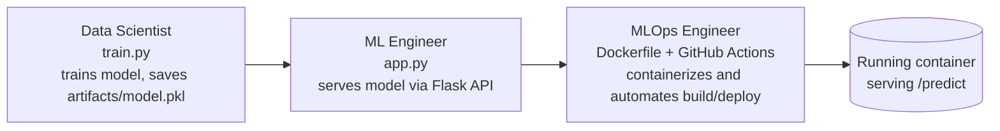

# Basic MLOps Project

A small end-to-end project I built while learning MLOps, showing how a model moves from
training → serving → automated, containerized deployment — and which role typically owns each step.

## The Idea

In a real team, three roles usually touch a model before it reaches users:

- **Data Scientist** — explores the data and trains the model
- **ML Engineer** — wraps the model in an API so other systems can use it
- **MLOps Engineer** — automates and operates the whole pipeline (build, test, containerize, deploy)

This project is a tiny simulation of that handoff, using the classic Iris dataset.



## What's in this repo

| File | Role | What it does |
|---|---|---|
| `train.py` | Data Scientist | Trains a Logistic Regression model on the Iris dataset and saves it to `artifacts/model.pkl`, along with accuracy metrics |
| `app.py` | ML Engineer | Flask API exposing `/health` and `/predict` endpoints so the model can be called over HTTP |
| `run_model.py` | ML Engineer | CLI script to run a prediction against the saved model without spinning up the API |
| `Dockerfile` | MLOps Engineer | Containerizes the app so it runs the same way anywhere |
| `.github/workflows` | MLOps Engineer | CI pipeline that automates build/test steps on every push |

## Running it locally

**1. Train the model**
```bash
pip install -r requirements.txt
python train.py
```
This creates `artifacts/model.pkl` and `artifacts/metrics.json`.

**2. Run the API**
```bash
python app.py
```
The API runs on `http://localhost:5001`.

**3. Test a prediction**
```bash
curl -X POST http://localhost:5001/predict \
  -H "Content-Type: application/json" \
  -d '{"features": [5.1, 3.5, 1.4, 0.2]}'
```

Or from the command line, without the API:
```bash
python run_model.py --input "[5.1,3.5,1.4,0.2]"
```

## Running it in Docker

```bash
docker build -t mlops-basics:latest .
docker run -p 5001:5001 mlops-basics:latest
```
Then hit it the same way as above, at `http://localhost:5001/predict`.

## What I learned building this

- How the same "automate everything" mindset from DevOps applies to ML — just with a model
  instead of an app as the thing being shipped
- The practical line between what a Data Scientist, ML Engineer, and MLOps Engineer each own
- Docker basics: build context size, `.dockerignore`, and yes — checking that Docker Desktop
  is actually running before assuming your build is broken

## What's next

- Deploying this container somewhere real
- Adding data/model versioning with DVC
- Experiment tracking with MLflow

---
Built as part of learning MLOps through Abhishek Veeramalla's *MLOps Zero to Hero* course.